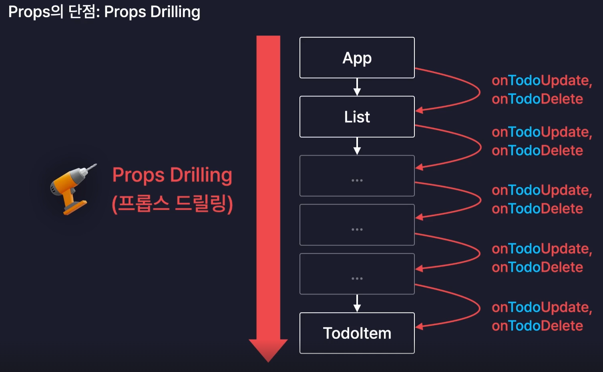
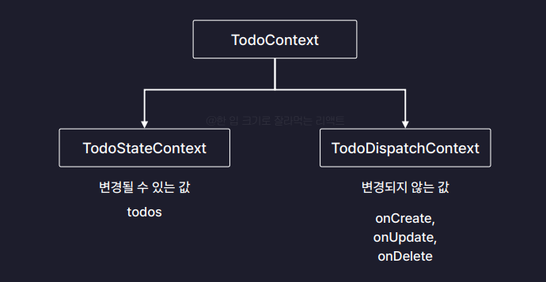
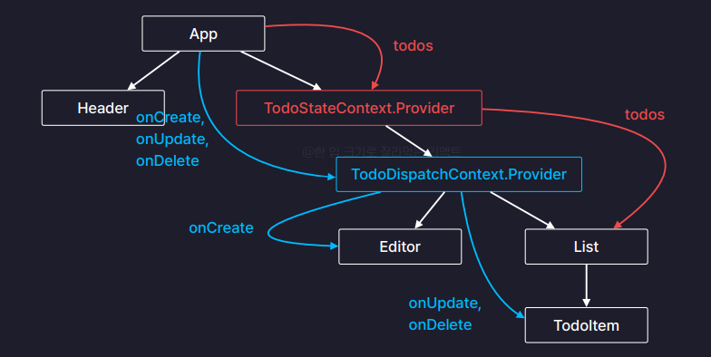

#### 📚 Context  
- 컴포넌트간의 데이터를 전달하는 또 다른 방법  
- 기존의 Props가 가지고 있던 단점을 해결할 수 있음  
👉 Props Drilling 을 해결할 수 있음!  

    

#### 📙 Context 분리
>🚨 TodoItem에 useMemo를 적용하여 해당 컴포넌트의 Props 값이 변경되지 않을 때에는 리렌더링이 되지 않도록 최적화를 했는데 context를 사용함(TodoContext)으로서 최적화가 풀리는 문제가 발생함!  
  - 부모 컴포넌트인 App 컴포넌트에서 TodoContext의 value props로 자식 컴포넌트에 전달하는 데이터에는 변경될 수 있는 값과 변경되지 않는 값이 섞여 있기 때문에 발생하는 문제! App 컴포넌트가 리렌더링 될때마다 TodoContext에 있는 함수들도 재생성되어 메모이제이션이 적용되지 않음.   
  👉 이때 Context 분리가 필요함!!  
  
    
  
